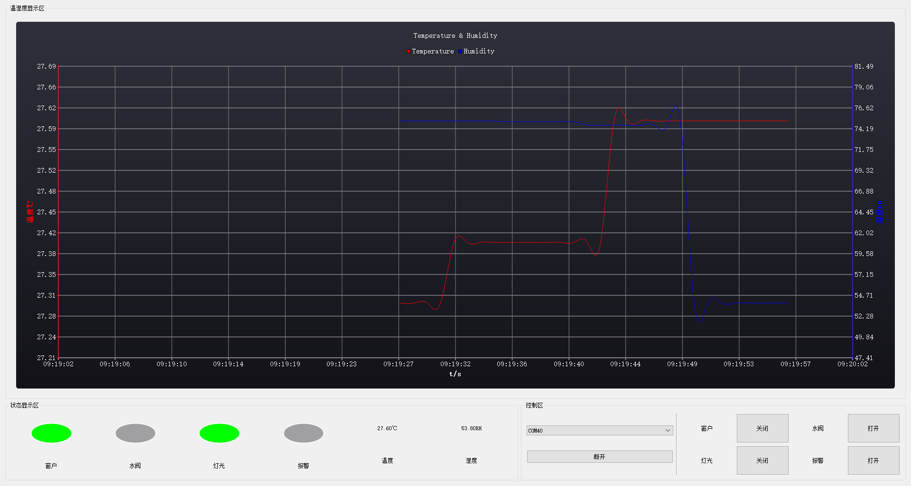

# QT火灾报警

主要技术：`QChart`

1. 横坐标随时间变化
2. 纵坐标自适应

### 通信协议

1. 串口通信参数 (**115200,8,1,N**)

   波特率（baud rate）： 115200bps
   数据位（data bits）： 8bits
   校验位（parity bit）： Not used
   结束位（stop bits）： 1bit  

2. 数据帧定义 

   **单片机->上位机(12Bytes)**

   | 字节序号 | 说明         | 可选值             |
   | -------- | ------------ | ------------------ |
   | byte0    | 帧头         | 0x3A               |
   | byte1    | 温度值低8位  |                    |
   | byte2    | 温度值高8位  |                    |
   | byte3    | 湿度值低8位  |                    |
   | byte4    | 湿度值高8位  |                    |
   | byte5    | 窗户开关状态 | 0x01：开；0x00：闭 |
   | byte6    | 水阀开关状态 | 0x01：开；0x00：闭 |
   | byte7    | 灯光开关状态 | 0x01：开；0x00：闭 |
   | byte8    | 报警开关状态 | 0x01：开；0x00：闭 |
   | byte9    | 保留位       |                    |
   | byte10   | 帧尾         | 0x0D               |
   | byte11   | 帧尾         | 0x0A               |

   **上位机->单片机（12Bytes）**

   | 字节序号 | 说明                | 可选值             |
   | -------- | ------------------- | ------------------ |
   | byte0    | 帧头                | 0x3A               |
   | byte1    | 温度值报警阈值低8位 | 保留不使用         |
   | byte2    | 温度值报警阈值高8位 | 保留不使用         |
   | byte3    | 湿度值报警阈值低8位 | 保留不使用         |
   | byte4    | 湿度值报警阈值高8位 | 保留不使用         |
   | byte5    | 窗户开关状态        | 0x01：开；0x00：闭 |
   | byte6    | 水阀开关状态        | 0x01：开；0x00：闭 |
   | byte7    | 灯光开关状态        | 0x01：开；0x00：闭 |
   | byte8    | 报警开关状态        | 0x01：开；0x00：闭 |
   | byte9    | 保留位              |                    |
   | byte10   | 帧尾                | 0x0D               |
   | byte11   | 帧尾                | 0x0A               |

## 展示

