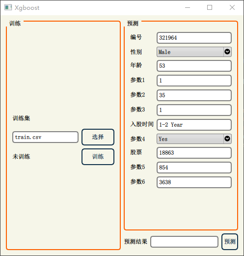

**C++ Python 联合编程**

> 未解决通过元组传递多个参数的问题

股票预测


## 环境配置

```shell
$conda create -n _xgboost python=3.8
$conda activate _xgboost
$conda install numpy==1.20.3
$conda install scipy==1.10.1
$conda install matplotlib==3.6.2
$conda install scikit-learn==1.2.0
$conda install xgboost==1.7.4
$conda install pandas==1.5.2
```


